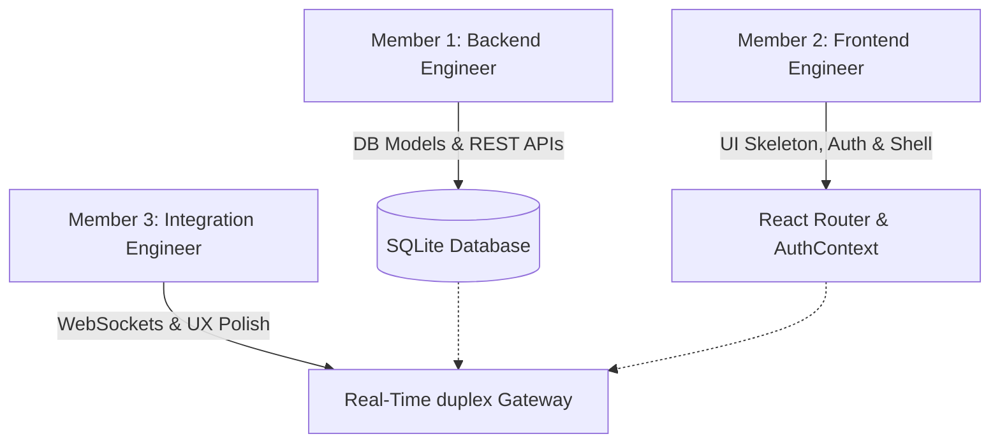

# Project Division & Git Workflow Plan: SyncTalk

This document outlines how the **SyncTalk** real-time messaging application (composed of a Python FastAPI/WebSocket backend and a React/Vite/Tailwind CSS frontend) should be divided among a team of **3 developers**. 

This plan is structured so that each team member has a distinct core responsibility, a logical progression of tasks, and **exactly 5 structured Git commits** (for a total of 15 commits). This ensures modular development, minimal merge conflicts, and clear, traceable progress.

---

## 👥 The Team Roles



1. **Member 1: Backend Developer (Database, API, & Security)**
   * *Focus*: Database schemas, SQLAlchemy models, security protocols, user password hashing, JWT credentials, and standard REST API endpoints.
2. **Member 2: Frontend Developer (Core UI, Routing, & Auth UX)**
   * *Focus*: Application UI shell, routing, client HTTP client configuration, authentication flows, sidebar contact list directory, and CSS layout transitions.
3. **Member 3: Integration & Real-Time Developer (WebSockets, Live States, & UX)**
   * *Focus*: Real-time message streaming protocols on both client and server, active presence statuses, live typing indicator events, and deep UI integration.

---

## 🛠️ Step-by-Step Commit Breakdown (5 Commits per Member)

### 🧑‍💻 Member 1: Backend Developer

```
[M1-C1] Initialize Skeleton ──> [M1-C2] Database Models ──> [M1-C3] JWT Security ──> [M1-C4] Auth APIs ──> [M1-C5] Directory & Chat REST APIs
```

#### **Commit 1: Repository Initialization & Backend Boilerplate**
* **Commit Message**: `chore: initialize backend skeleton and environment configuration`
* **Files Affected**: 
  * `backend/requirements.txt`
  * `backend/app/config.py`
  * `backend/app/main.py`
* **Work Summary**: Specify python dependencies (FastAPI, Uvicorn, SQLAlchemy, PyJWT, Passlib). Set up environment settings parsing with `pydantic-settings` to manage database URLs and JWT secret keys. Establish basic health check routes on FastAPI.

#### **Commit 2: Database Schema & SQLAlchemy Models**
* **Commit Message**: `feat: define User and Message database schemas`
* **Files Affected**:
  * `backend/app/database.py`
  * `backend/app/models/user.py`
  * `backend/app/models/message.py`
* **Work Summary**: Configure the SQLAlchemy database engine wrapper. Create tables for `users` (credentials, active status, last seen) and `messages` (sender, recipient, content, timestamp, read flag) with foreign key constraints and relationships.

#### **Commit 3: JWT Security Core & Validation Schemas**
* **Commit Message**: `feat: implement password hashing and JWT authentication helpers`
* **Files Affected**:
  * `backend/app/auth/security.py`
  * `backend/app/schemas/user.py`
  * `backend/app/schemas/auth.py`
  * `backend/app/schemas/message.py`
* **Work Summary**: Code secure utilities using `bcrypt` to hash and verify user passwords. Create standard Pydantic models for incoming and outgoing data parsing (user creation, login tokens, message responses) to shield db schemas.

#### **Commit 4: Authentication API Routes**
* **Commit Message**: `feat: add user registration and login REST endpoints`
* **Files Affected**:
  * `backend/app/routes/auth.py`
  * `backend/app/routes/deps.py`
* **Work Summary**: Develop routers checking for existing users/emails on registration, generating password hashes, and storing new user rows. Build `/login` supporting OAuth2 form specifications and generating signed JWT tokens. Write dependency injection functions to resolve the current active session.

#### **Commit 5: User & Message REST APIs**
* **Commit Message**: `feat: implement user directory search and paginated chat history APIs`
* **Files Affected**:
  * `backend/app/routes/users.py`
  * `backend/app/routes/messages.py`
* **Work Summary**: Implement `/api/users/` router to fetch the user directory excluding the requester. Implement `/api/messages/{recipient_id}` retrieving the historical direct message logs with pagination support, sorting records chronologically before returning.

---

### 🎨 Member 2: Frontend Developer

```
[M2-C1] React-Vite & Tailwind ──> [M2-C2] HTTP Service & Auth Views ──> [M2-C3] AuthContext ──> [M2-C4] Sidebar Component ──> [M2-C5] Custom CSS Polish
```

#### **Commit 1: React + Vite Setup with Tailwind CSS Integration**
* **Commit Message**: `chore: initialize React frontend skeleton with Tailwind and routing`
* **Files Affected**:
  * `frontend/package.json`
  * `frontend/tailwind.config.js`
  * `frontend/src/main.jsx`
  * `frontend/src/App.jsx`
* **Work Summary**: Initialize the React app shell using Vite. Connect Tailwind utility configurations. Establish a standard Router hierarchy in `App.jsx` supporting endpoints `/login`, `/register`, and `/` dashboard.

#### **Commit 2: HTTP Client & Auth Views (Login & Register)**
* **Commit Message**: `feat: construct registration and login page interfaces`
* **Files Affected**:
  * `frontend/src/services/api.js`
  * `frontend/src/pages/Login.jsx`
  * `frontend/src/pages/Register.jsx`
* **Work Summary**: Configure an Axios client instance with standard base URLs, handling auto-injection of JWT credentials from local storage. Design custom sleek authentication pages leveraging Tailwind, including error state notifications.

#### **Commit 3: Authentication Context State & Protected Route Gates**
* **Commit Message**: `feat: add AuthProvider context and Route Protection wrappers`
* **Files Affected**:
  * `frontend/src/context/AuthContext.jsx`
  * `frontend/src/components/ProtectedRoute.jsx`
* **Work Summary**: Build a comprehensive React Context storing the verified user, session loading indicators, registration callbacks, and logout routines. Write a `<ProtectedRoute>` layout wrapper blocking non-authenticated connections.

#### **Commit 4: Contact Directory Sidebar Component**
* **Commit Message**: `feat: build user directory sidebar with real-time query filter`
* **Files Affected**:
  * `frontend/src/components/Chat/Sidebar.jsx`
  * `frontend/src/components/UserAvatar.jsx`
* **Work Summary**: Create the side navigational list. Integrate user search filtering profiles dynamically by username query inputs. Attach user avatars, active presence icons, current sessions, and logout buttons.

#### **Commit 5: Frontend Design System Core Styles**
* **Commit Message**: `style: establish core CSS animations, custom scrollbars, and scroll helpers`
* **Files Affected**:
  * `frontend/src/index.css`
  * `frontend/src/App.css`
* **Work Summary**: Incorporate deep visual styling, loading spin animations, typing indicator bounce effects, dark mode container scrollbars, and typography layouts from Outfit/Inter Google fonts.

---

### 🔌 Member 3: Integration & Real-Time Developer

```
[M3-C1] WS Server Manager ──> [M3-C2] Client SocketProvider ──> [M3-C3] ChatWindow UI ──> [M3-C4] Real-time Interactivity ──> [M3-C5] Scroll & UI Polish
```

#### **Commit 1: WebSocket Backend Manager & Real-Time Gateway**
* **Commit Message**: `feat: develop WebSocket ConnectionManager and ws endpoint gateway`
* **Files Affected**:
  * `backend/app/websocket/manager.py`
  * `backend/app/websocket/endpoint.py`
* **Work Summary**: Implement `ConnectionManager` to broker active socket pools, broad presence signals, and direct peer dispatches. Hook the `/ws` duplex gateway with custom query string JWT verification logic. Write connection loop event routing rules.

#### **Commit 2: Frontend Socket Context Wrapper & Connection Lifecycle**
* **Commit Message**: `feat: create SocketProvider context with auto-reconnection logic`
* **Files Affected**:
  * `frontend/src/context/SocketContext.jsx`
* **Work Summary**: Code `SocketContext` handling background socket open sequences when Auth profiles are available. Implement inbound event listeners (`presence_change`, `new_message`, `typing_status`) and write a robust 5-second automatic reconnection heartbeat cycle.

#### **Commit 3: Main Chat View & Message Stream Renderer Component**
* **Commit Message**: `feat: develop ChatWindow container with direct messaging support`
* **Files Affected**:
  * `frontend/src/pages/Dashboard.jsx`
  * `frontend/src/components/Chat/ChatWindow.jsx`
* **Work Summary**: Create the primary dialogue viewport frame. Implement chronological historical chat rendering using Axios hooks. Bind live buffered messages incoming from the websocket channel directly to user layouts, filtering out other threads.

#### **Commit 4: Live Activity Features (Typing Indicators & Presence States)**
* **Commit Message**: `feat: integrate typing feedback and global user presence indicators`
* **Files Affected**:
  * `frontend/src/components/Chat/ChatWindow.jsx` (updates)
  * `frontend/src/components/Chat/Sidebar.jsx` (updates)
* **Work Summary**: Hook active user input changes to WebSocket events (`typing_status`). Establish typing debounce timers (2.5 seconds) to toggle indicators off when inactive. Connect the real-time user presence indicators to color active sidebar contacts.

#### **Commit 5: Scroll Anchoring & Message Input UX Polish**
* **Commit Message**: `refactor: optimize message scroll locking, form controls, and icons`
* **Files Affected**:
  * `frontend/src/components/Chat/ChatWindow.jsx` (final pass)
  * `frontend/src/components/Chat/Sidebar.jsx` (final pass)
* **Work Summary**: Establish DOM ref trackers (`messagesEndRef`) to force smooth automatic viewport adjustments to the bottom of the feed whenever messages update. Block empty inputs, integrate Lucide icons, and attach placeholder styling variables.

---

## 🔀 Recommended Git Flow & Integration Strategy

To keep the development fluid and avoid friction:

```
                  ┌─ Member 1: feature/backend-core ───────────┐
                  │                                            │
[main branch] ────┴─ Member 2: feature/frontend-shell ─────────┼──> Merge & Verify (REST APIs) ───┬───> Real-Time Integration (WebSockets)
                  │                                            │                                  │
                  └─ Member 3: feature/websocket-manager ──────┘                                  └─ Member 3: feature/realtime-integration
```

1. **Step 1: Branch Isolation**
   * Member 1 creates `feature/backend-core`.
   * Member 2 creates `feature/frontend-shell`.
   * Member 3 creates `feature/websocket-manager`.
2. **Step 2: Core Merge & REST Verification**
   * Member 1 merges their REST services into `main` after setting up verification tests.
   * Member 2 pulls the updated `main` to align their Axios calls.
3. **Step 3: Real-Time Integration**
   * Member 3 pulls both completed REST architectures to fully connect socket triggers and live UI views under `feature/realtime-integration` and completes the application loop.
